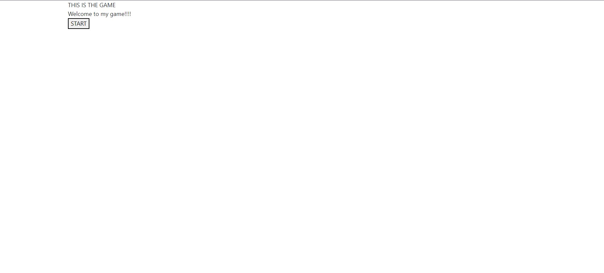
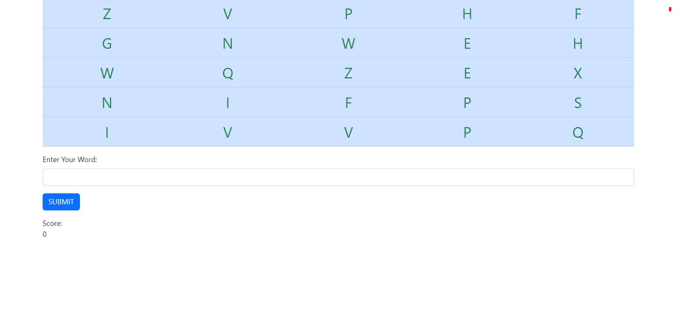
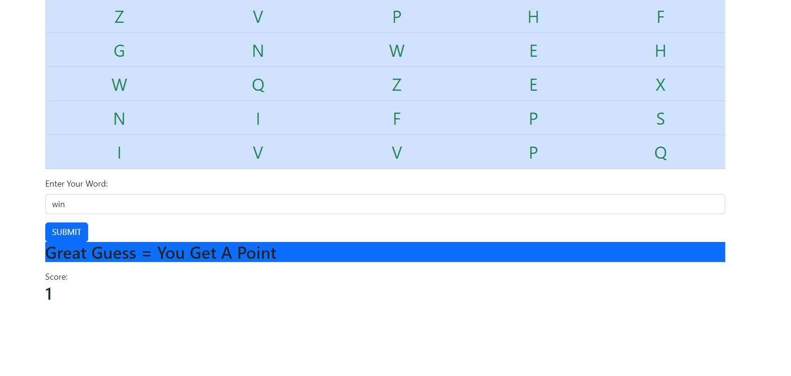
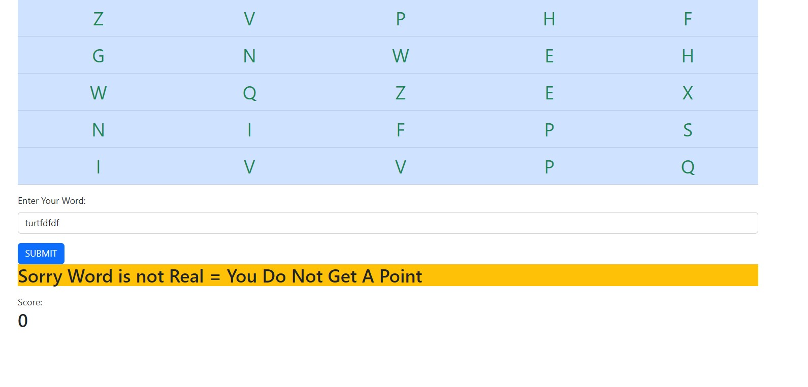
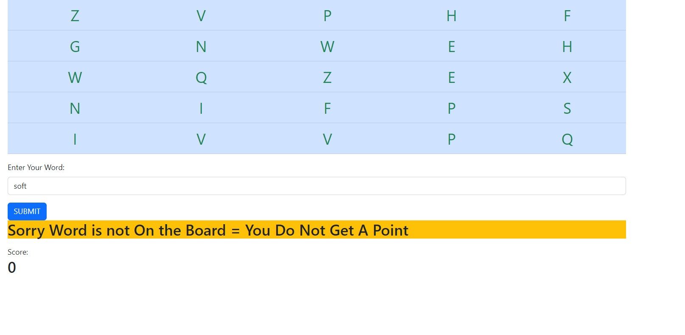
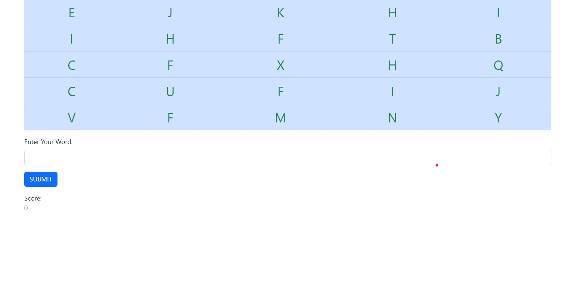

# Rons Boggles Could Not Make Video So I Added Screen Shots Below.

This Boggle game was created using Flask, JS, HTML, and CSS

## Installation

Use the package manager [pip](https://pip.pypa.io/en/stable/) to install the requirements.

```bash
pip install -r requirements.txt
```


## Contributing

Creator: Ron Goodwin

## Created Screen Shots Because I Can't Make a Video







## License

[MIT](https://choosealicense.com/licenses/mit/)